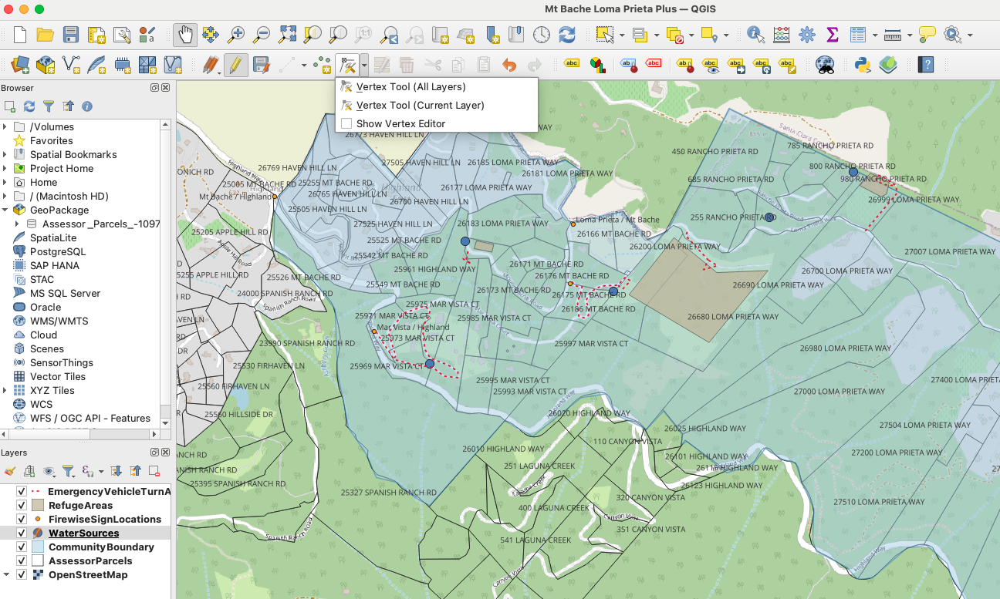
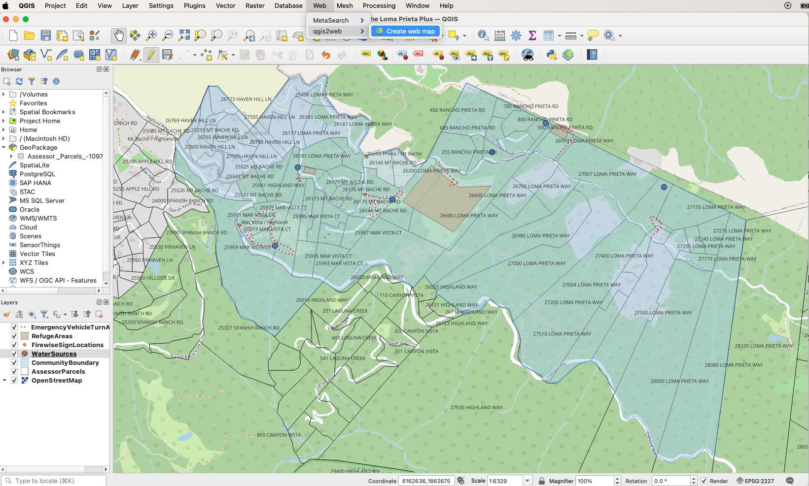
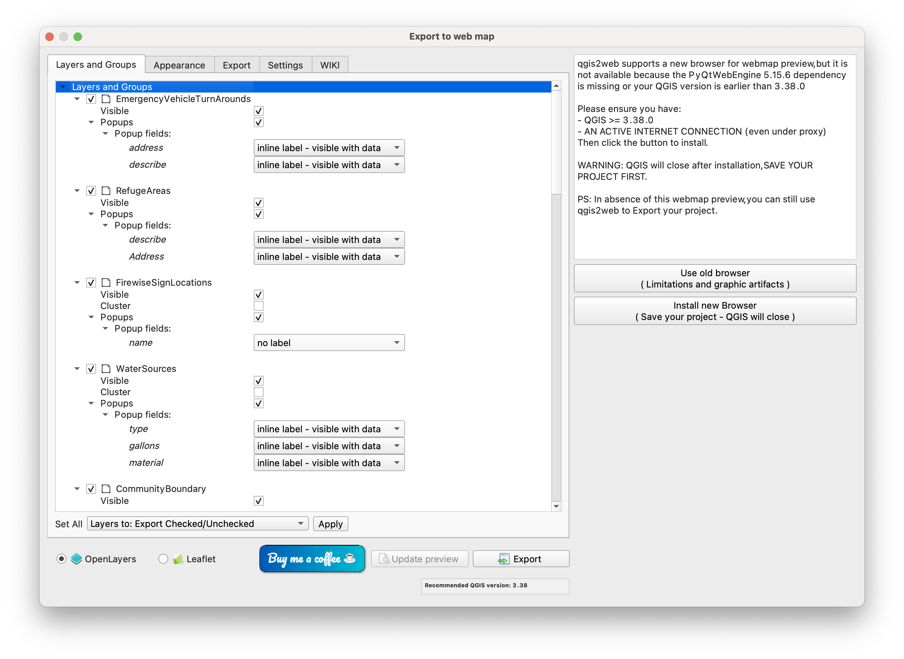
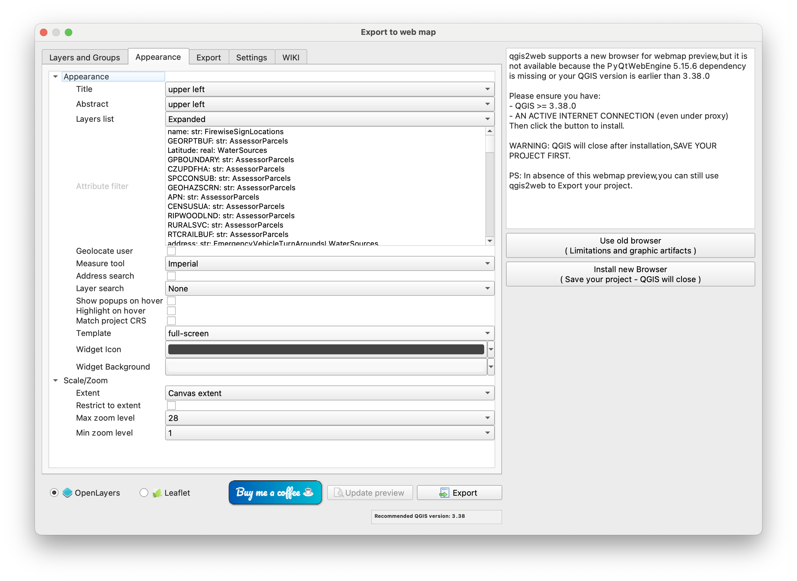

# Mt Bache Loma Prieta Plus Firewise Community Map Project

Jump right in and [*explore our latest community map*](https://winkleramy.github.io/MtBacheLomaPrietaPlus/map.html)!

Or select a topic below:
1. [Status](#status)
2. [Contribute](#be-a-contributor)
3. [Workflow](#workflow)
4. [Resources](#resources)

Interactive Map Preview:
<iframe src="map.html" height="600" width="600"></iframe>

## Status

One of our community goals in 2025 is to create a map of our community for emergency services, highlighting:
- Water Sources
- Emergency Vehicle Turn-Arounds
- No Exit / No Turn-Around 
- Refuge Areas
- Evacuation Routes

We are sharing this information with CAL FIRE to reference in case of a wildfire event. We currently have an interactive map of our community with helpful metadata associated with key features, such as water sources. For example, in the interactive map, click on a blue icon to see more information about a particular water source.

## Be a Contributor!

We would like this map to be as representative of our community as possible! To share information about water sources, emergency vehicle turn-arounds, or other helpful resources on your property for CAL FIRE in case of a wildfire event, please contact to me at [winkleramy@gmail.com](mailto:winkleramy@gmail.com?subject=Community%20Map%20Project). 

For water sources, please include the following information: 
- Property Address
- Type of water storage, e.g. 2x water tanks, 1x in-ground pool, 1x hydrant, 1x cistern
- Capacity in gallons for each water source
- Specific location in latitude and longitude to at least 5 decimal places for each water source. *This can be tricky! One way to get this information is to open Google maps and drop a pin at the location of your water source.* 
- Material composition, e.g. polyethylene tank, steel tank, cement pool
- How water is collected, e.g. spring-fed, well on property, rain collection

For fire hydrants:
- color of the hydrant, 
- flow rate, 
- hose outlet size

Some tips from CAL FIRE and the Fire Safe Council for water sources:
- During the CZU Fire, a number of polyethylene tanks melted when the adjacent brush caught fire. For polyethylene tanks, the recommendation is the clear at least a 5’ zone, similar to the home ignition zone of your house. 
- The more water storage capacity, the better! 10,000 gallons or more per property is the current recommendation. CAL FIRE will put their hose directly into a water tank and use their own pump to pressurize the hose. 
- Fire hydrants should be tested annually by a professional. If your hydrant has been tested recently, it is more likely to be used! Among other things, the test checks for:
- Debris, which may flow from the hydrant system and clog an attached fire hose. This is a big concern among firefighters! In many instances, firefighters forego using private hydrants to avoid possible damage to their hoses. 
- Flow Rate, which should match the color of the hydrant. If the hydrant hasn’t been tested recently, the rated flow cannot be trusted.

## Workflow 

The current workflow leverages the open source software [QGIS](https://www.qgis.org) and assessor parcel data from Santa Cruz County's [GISWeb](https://gis.santacruzcounty.us/gisweb/). Community participants share information about relevant features on their properties. The map coordinator (me) then marks the position of relevant features on the assessor parcel map within QGIS, enters any relevant metadata, and exports to html using the qgis2web plugin. The exported files are then pushed to the main branch of this repository and automatically published to GitHub Pages. This workflow with QGIS, qgis2web, and github follows this [example](https://gispofinland.medium.com/why-you-should-use-qgis2web-plugin-github-pages-to-produce-interactive-maps-3d057069d8a1).

### Add or Edit Map Features
To edit, pull this repository or download the contents of the [src folder](https://github.com/winkleramy/MtBacheLomaPrietaPlus/tree/main/src). Using QGIS 3.40 or later, open the file MtBacheLomaPrietaPlus.qgz. Right click on the CommunityBoundary layer and select 'Zoom to Layer'. 

Identify relevant map features in the appropriate vector layer. Vector layers include WaterSources, EmergencyVehicleTurnArounds, etc. To confirm the latitude/longitude of point features, select the Vertex Tool, available in the Digitizing Toolbar at the top. 

<!--  -->

### Export to Web

When ready to publish, navigate to the Web menu, qgis2web, Create web map. 

<!--  -->

In the export window, select the following options:
- Layers and Groups: Check Visible and Popups for all Layers. In popup fields, select 'inline label - visible with data' for include labels in the popup map data.

<!--  -->

- Appearance: Title 'upper left', Abstract 'lower right', Layers list 'Expanded' (creates legend at the top right), Template: 'full-screen' (adjusts map size to viewing screen)
- Select OpenLayers radio button at the bottom and then click Export

<!--  -->

- Copy data from export folder into MtBacheLomaPrietaPlus
- Change 'index.html' to 'map.html'
- Run [reduceAssessorParceljsFileSize.py](reduceAssessorParceljsFileSize.py) in order to upload AssessorParcel_1.js file without git-lfs tool (which is not compatible with GitHub Pages html viewer)
- Modify transparency of Community Boundary and Refuge Areas by navigating to [styles](https://github.com/winkleramy/MtBacheLomaPrietaPlus/tree/main/styles), opening each js file, and editing
-- ol.style.Fill({color: 'rgba(166,206,227,1.0)'}) --> ol.style.Fill({color: 'rgba(166,206,227,0.5)'})
- Modify lineDash of Emergency Vehicle Turnarounds by navigating to [styles](https://github.com/winkleramy/MtBacheLomaPrietaPlus/tree/main/styles), opening the js file, and editing
-- ol.style.Stroke({color: 'rgba(219,30,42,1.0)', lineDash: null, ...}) --> ol.style.Stroke({color: 'rgba(219,30,42,1.0)', lineDash: [0.1,5], ...})
- Push to GitHub

### Share with CAL FIRE 

The map coordinator (me) zips the [ESRI shape files](https://github.com/winkleramy/MtBacheLomaPrietaPlus/tree/main/src/Layers), and emails them to Frank Rodgers, CAL FIRE Fire Captain - Pre-Fire Engineering, San Mateo-Santa Cruz Unit.

## Resources

- [Mt Bache Loma Prieta Plus Firewise Community Page](https://winkleramy.github.io/Firewise/) 
- [GISWeb](https://gis.santacruzcounty.us/gisweb/)
- [Download QGIS](https://www.qgis.org)
- [QGIS GitHub Publishing Example](https://gispofinland.medium.com/why-you-should-use-qgis2web-plugin-github-pages-to-produce-interactive-maps-3d057069d8a1)

## Debug Section

<iframe class="pdf" data="https://github.com/winkleramy/Firewise/blob/main/Updates/Update%202025%20Q1.pdf" width="800" height="500"></iframe>
